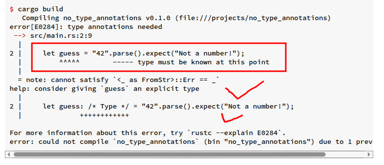
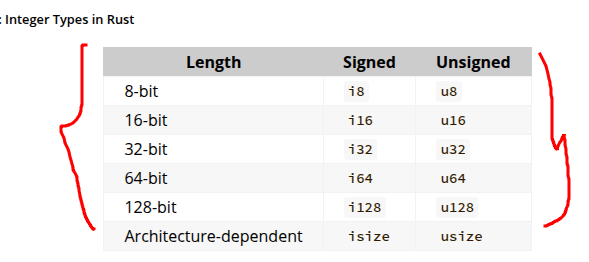

Even value in Rust is of a certain data type, which tells Rust what king od data is being specified so that it knows how to work with that data. We'll look at two data type subsets: ```scalar and compound```.

Keep in mid that Rust is a statically typed language, which means that it must know the types of all variables at compile time. The compiler can usually infer what type we want to use based on value and how we use it. In cases when many types are possible, such as when we converted a ```String``` toa  numeric type using parse in the "Comparing the Guess to the Secret Number" 
We must add atype annotation, like this:

```rs
    let guess: u32 = "42".parse().expect("Not a number");
```

If we don't add the :u32 type annotation shown in the preceding code. Rust will display the following error, which means the compiler needs more information from us to know which type we want to use.



### Scalar Types
- A scalar type represents a single value. Rust has four primary scalar types: integers, floating-point numbers, Booleans, and characters

    - Integer Types : 
    An integer is a number without a fractional component (signed integer types start with i instead of u)



Signed numbers are stored using 2's complement representation.
Each signed variant can store numbers from -(2^n-1) to 2^n-1

Continue.....


### Compound Types